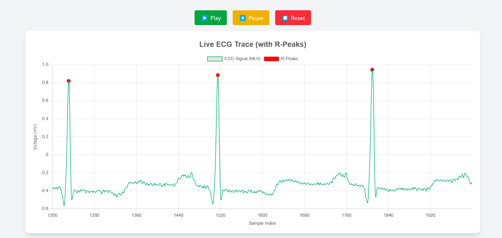

# 🫀 ECG Visualizer - React App

A real-time ECG (Electrocardiogram) visualizer built with **React** and **Chart.js**, displaying MLII (Modified Lead II) readings. The data is sourced from **[PhysioNet](https://physionet.org/)**, and R-peaks are visualized to highlight heartbeats.

---

## 🚀 Features

- 📈 Live ECG waveform rendering using Chart.js
- 🧠 Displays **R-peaks** detected from the signal
- ⏯️ Play / Pause / Reset controls for waveform scrolling
- 📁 Uses real MLII data from PhysioNet datasets
- 💡 Fully responsive and interactive chart

---

## 📦 Dataset Used

- **Source:** PhysioNet MIT-BIH Arrhythmia Database
- **Files:**
  - `mlii.json`: Contains raw ECG values from the MLII lead
  - `r_peaks.json`: Array of sample indices where R-peaks are detected

---

## 🛠️ Tech Stack

- **Frontend:** React, Tailwind CSS
- **Charting:** Chart.js (react-chartjs-2)
- **Data Format:** JSON

---

## 📂 Folder Structure

```
/public
  └── mlii.json          # MLII ECG data
  └── r_peaks.json       # R-peak indices
/src
  └── ECGChart.jsx       # Main ECG visualization component
  └── App.jsx
  └── index.js
```

---

## 📸 Screenshot



---

## 📚 References

- [PhysioNet: MIT-BIH Arrhythmia Database](https://physionet.org/content/mitdb/1.0.0/)
- [Chart.js Documentation](https://www.chartjs.org/docs/latest/)
- [React Chart.js 2](https://react-chartjs-2.js.org/)

---